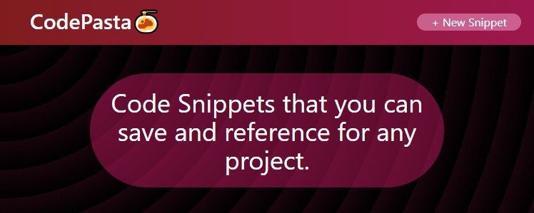

# CodePasta - A Code Snippet Web Application



A WIP MERN stack ([MongoDB](https://www.mongodb.com/), [Express](http://expressjs.com/), [React](https://reactjs.org/) and [Node.js](https://nodejs.dev/)) code snippet CRUD application.

## Description

CodePasta started life as an attempt to port an old code snippet CSS styling exercise using React components out of boredom. After realizing that this was likely overkill for a fairly simple static application, create, read, write and delete functionality was added using MongoDB/No-SQL as the database paradigm, along with backend API routing using Express. This was also a good excuse to learn and try out [Tailwind CSS](https://tailwindcss.com/). It's basically a glorified to-do list.

## Installation

To install and run this application locally, you can either run a development build, or create a production build.

### Development Build

1. Make sure you have [Node.js](https://nodejs.dev/) installed on your local machine.
2. You will need to have a MongoDB server installed on your local machine to access the data locally. You can install the community version [here](https://www.mongodb.com/try/download/community).
3. Then clone or download the repository. There are two folders in this repository, one for the front end ( `/client` ) and one for the backend ( `/api` ). Each has their own `package.json`, so you will need to install dependencies for both directories.
```
	// Navigate into the client directory, and run npm install
	cd ./client
    npm install

	// Navigate into the api directory, and run npm install
	cd ./api
	npm install
```
4. You'll have to also run both servers that are running on `localhost:3000` (front end), and `localhost:3001` by running the following:
```
	// Navigate into the api directory, and run npm start
	cd ./api
    npm start

	// Navigate into the client directory, and run npm start
	cd ./client
    npm start
```
5. After which, you can open up `localhost:3000` on your web browser to view and use the application.

### Production Build

1. Alternatively, if you want to try out a production build, run `npm run build` in the `./client` directory after installing all the dependencies:
```
	cd ./client
	npm run build
```
2. This will create a new `./build` folder in the `./client` directory. Cut and paste that directory into the root directory of `./api`.
3. Now run `npm start` in the `./api` directory. It will launch a production build of the application on `localhost:3001`.

## Usage

* Click the "+ New Snippet" button in the navbar to add a new snippet.
* Click the clipboard to copy the specific snippet to your clipboard (assuming you've allowed permissions).
* Click the update button to toggle on edit mode, which lets you edit the text area of the snippet. Clicking cancel will revert the snippet to the original value.
* Click the delete button to delete the snippet.

## Future Features in Development

* Ability to edit title of the snippet!
* Refactor React component source code (right now it's very jank and hacky)!
* Better responsiveness!
* Add animations!
* ~~Ability to order pasta from the app!~~ Someday.

## Issues

Any suggestions or problems can be submitted in [issues](https://github.com/inknsharps/CodePasta/issues).
